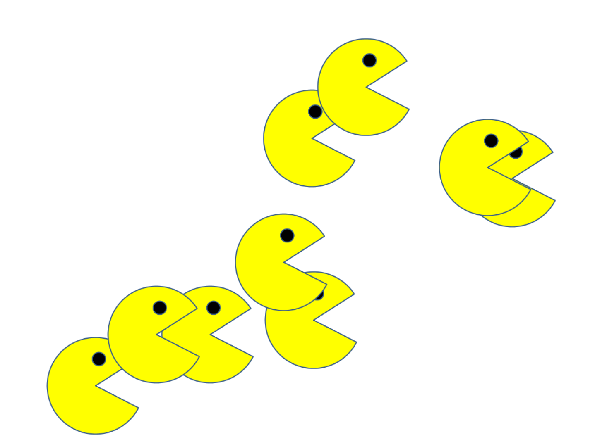

# PacMen
This PacMen exercise contains code for generating multiple pac-men that bounce around the screen. It sets up two buttons: one that adds PacMen to the screen and another that starts the game so they start bouncing around on the screen at random velocities.

## How to Run
In order to run this code, after having the repo cloned, all that's needed is to open `index.html` in a browser. From there, click on "Add PacMan" to add pac-men to the screen. Then click "Start Game" in order to see the pac-men start moving. You can continue clicking "Add PacMan" after that point to add more moving pac-men to the screen.

## Roadmap of Future Improvements
In the future, the hope is to improve on this project by incorporating the various images included in the repo so that the pac-men generated move like the typical pac-man that opens and closes its mouth, as well as switches to face the opposite direction when it bounces off a wall. Anothers improvement is to add a background behind the pac-men, potentially with other obstacles they can bounce off of, to make the game more visually appealing.